# pytermor

@TODO

## Use cases

<table><tr>
 <td><h3>Simple text coloring</h3></td>
 <th>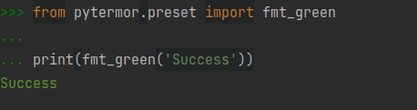</th>
</tr><tr><td colspan=2 width="1000px">

```python
from pytermor.preset import fmt_green

print(fmt_green('Success'))
```
</td></tr><tr>
 <td><h3>Format overlapping</h3></td>
 <th>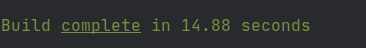</th>
</tr><tr><td colspan=2>

```python
from pytermor.preset import fmt_green, fmt_underline

msg = fmt_green('Build ' + fmt_underline('complete') + ' in 14.88 seconds')
print(msg)
```
</td></tr><tr>
 <td><h3>Flexible definitions</h3></td>
 <th>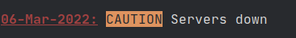</th>
</tr><tr><td colspan=2>

```python
from pytermor import build, Format, RESET
from pytermor.preset import UNDERLINED

seq_date = build('red', 1, UNDERLINED)  # mix with integer codes and other sequences
fmt_caution = Format(build('inversed', 'YELLOW'),  # case-insensitive
                     reset_after=True)

msg = f'{seq_date}06-Mar-2022:{RESET} ' + \
      fmt_caution('CAUTION') + \
      f' Servers down'
print(msg)
```
</td></tr><tr>
 <td><h3>Custom formats</h3></td>
 <th>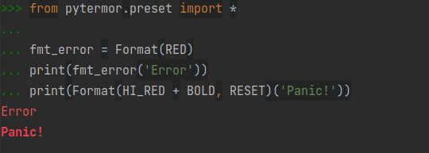</th>
</tr><tr><td colspan=2>

```python
from pytermor.preset import *

fmt_error = Format(RED + CROSSLINED + BOLD,
                   reset_after=True)
msg = fmt_error('Error') + Format(HI_RED + INVERSED, RESET)('Panic!')
print(msg)
```
</td></tr><tr>
 <td><h3>Fine tuning</h3></td>
 <th>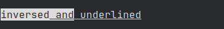</th>
</tr><tr><td colspan=2>

```python
from pytermor.preset import fmt_inverse, fmt_underline

msg = f'{fmt_inverse.open}inversed' \
      f'{fmt_underline.open} and' \
      f'{fmt_inverse.close} underlined' \
      f'{fmt_underline.close}'
print(msg)
```
</td></tr><tr>
 <td><h3>Low-level inlines</h3></td>
 <th>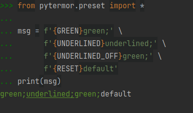</th>
</tr><tr><td colspan=2>

```python
from pytermor.preset import *

msg = f'{GREEN}green;' \
      f'{UNDERLINED}underlined;' \
      f'{UNDERLINED_OFF}green;' \
      f'{RESET}default'
print(msg)
```
</td></tr><tr>
 <td><h3>8-bit color mode support</h3></td>
 <th rowspan=2>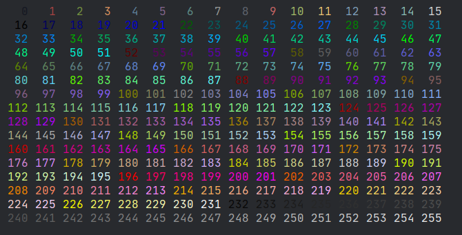</th>
</tr><tr><td>

```python
from pytermor import build_text256, RESET

print(''.join([
    f'{build_text256(i)}{i:>4d}{RESET}' +
    ('\n' if i % 16 == 15 else '')
    for i in range(0, 256)
]))
```
</td></tr></table>
<br>

## API | `SGRSequence` class

Class describing SGR-mode ANSI escape sequence with varying amount of parameters. To get the resulting sequence simply cast instance to `str`, like here:

<table><tr>
 <td rowspan="2">

 Left part consists of "applied" escape sequences; right part shows up one of the sequences in raw mode; as if it was ignored by the terminal.

 `\x1b` is ESC _control character_, which opens a control sequence (can also be written as `\e`|`\033`|`ESC`).

 `[` is sequence _introducer_, it determines the type of control sequence (in this case it's CSI, or "Control Sequence Introducer").

 `1` and `4` are _parameters_ of the escape sequence; they mean "bold text" and "underlined text" respectively. Those parameters must be separated by `;`.

 `m` is sequence _terminator_; it also determines the sub-type of sequence, in our case SGR, or "Select Graphic Rendition". Sequences of this kind are most commonly encountered.

</td>
 <th>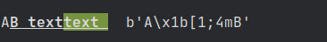</th>
</tr><tr><td>
    
```python3
from pytermor.sequence import SGRSequence
from pytermor.preset import BG_GREEN, RESET

seq1 = 'A' + str(SGRSequence(1, 4)) + 'B'
seq2 = f'text{BG_GREEN}text'
print(seq1, seq2, str(RESET), '', seq1.encode())
```

</td></tr><tr>
 <td rowspan="2">

 One instance of `SGRSequence` can be added to another. This will result in a new `SGRSequence` instance with combined params.

 </td>
 <th>
 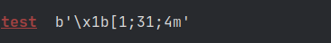 
 </th>
</tr><tr>
 <td>

```python
from pytermor import SGRSequence
from pytermor.preset import RESET

new_seq = SGRSequence(1, 31) + SGRSequence(4)
print(f'{new_seq}test{RESET}', '', f'{new_seq}'.encode())
```

 </td>
</tr><tr>
 <td rowspan="2">

 Pretty much all single-param sequences (that can be used at least for _something_) are specified in `pytermor.preset` module. **Complete list is given at the end of this document.** Example usage:

 </td>
 <th>
  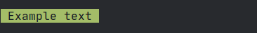
 </th>
</tr><tr>
 <td>

```python
from pytermor.preset import BLACK, BG_HI_GREEN, RESET

print(f'{BLACK}{BG_HI_GREEN}', 'Example text', str(RESET))
```

</td></tr></table>
<br>

## API | `Format` class

`Format` is a wrapper class that contains starting (i.e. opening) `SGRSequence` and (optionally) closing `SGRSequence`. 

<table><tr>
 <td>

You can define your own reusable formats or import predefined ones from `pytermor.preset`:
</td><th width="70%">
 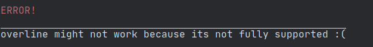
 </th>
</tr>
<tr>
 <td colspan="2">

```python
from pytermor.format import Format
from pytermor.preset import HI_RED, fmt_overline

fmt_error = Format(HI_RED, reset_after=True)
print(fmt_error('ERROR!'))
print(fmt_overline.open +
      'overline might not work because'
      ' its not fully supported :(' +
      fmt_overline.close)
```

 </td>
</tr></table>

The main purpose of `Format` is to simplify creation of non-resetting text spans, so that developer doesn't have to restore all previously applied formats after every closing sequence (which usually consists of `RESET`).


Example: we are given a text span which is initially **bold** and <u>underlined</u>. We want to recolor a few words inside of this span. By default this will result in losing all the formatting to the right of updated text span (because `RESET`|`\e[m` clears all text attributes).

<table><tr>
 <td>

However, there is an option to specify what attributes should be disabled (instead of disabling _all_ of them):
</td><th width="50%">
 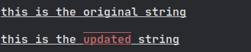
 </th>
</tr>
<tr>
 <td colspan="2">

```python
from pytermor.format import Format
from pytermor.preset import HI_RED, COLOR_OFF, OVERLINED, OVERLINED_OFF, \
                            fmt_bold, fmt_underline

fmt_error = Format(
    HI_RED + OVERLINED,  # sequences can be summed up, remember?
    COLOR_OFF + OVERLINED_OFF,  # "counteractive" sequences
    reset_after=False
)
orig_text = fmt_bold(fmt_underline(
    'this is the original string'
))
updated_text = orig_text.replace('original', fmt_error('updated'), 1)
print(orig_text)
print(updated_text)
```

 </td>
</tr></table>

As you can see, the update went well &mdash; we kept all the previously applied formatting. Of course, this method cannot be 100% applicable &mdash; for example, imagine that original text was colored blue. After the update "string" word won't be blue anymore, as we used `COLOR_OFF` escape sequence to neutralize our own red color. But it still can be helpful for a majority of cases (especially when text is generated and formatted by the same program and in one go).
<br><br>

## API | `StringFilter` superclass

**Purpose:** to provide common string modifier interface with dynamic configuration support. 

### Subclasses

   - `ReplaceSGRSequences`
   - `ReplaceCSISequences`
   - `ReplaceNonAsciiBytes`

<table>
<tr>
 <td><h3>Standalone usage</h3></td>
 <th>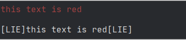</th>
</tr>
<tr>
 <td colspan="2" width="1000px">

 ```python
from pytermor.preset import fmt_red
from pytermor.string_filter import ReplaceSGRSequences

formatted = fmt_red('this text is red')
print(formatted)
print(ReplaceSGRSequences('[LIE]').invoke(formatted))
# or:
# ReplaceSGRSequences('[E]')(formatted)
```

 </td>
</tr>
<tr>
 <td>
 <h3>Usage with <code>apply_filters</code></h3>
 </td>
 <th>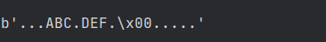</th>
</tr>
<tr>
 <td colspan="2">

```python
from pytermor import apply_filters
from pytermor.string_filter import ReplaceNonAsciiBytes

ascii_and_binary = b'\xc0\xff\xeeABC\xffDEF\xeb\x00\xc0\xcd\xed\xa7\xde'

# can either provide filter by type (default settings will be used):
# result = apply_filters(ascii_and_binary, ReplaceNonAsciiBytes)
# ..or instantiate and configure it:
result = apply_filters(ascii_and_binary, ReplaceNonAsciiBytes(b'.'))

print(result)
```

 </td>
</tr></table>
<br>

## Presets

wip


* Prefix `BG_*` indicates that this sequence changes background color, not the text color.
* Prefix `HI_*` means "high intensity" &mdash; brighter versions of default colors.
