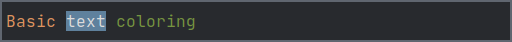
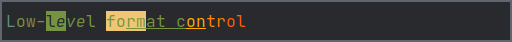
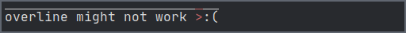
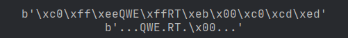

# pytermor

_(yet another)_ Python library designed for formatting terminal output using ANSI escape codes. Also provides a registry of SGR sequences and formats (=combined sequences).

## Motivation

Key feature of this library is providing necessary abstractions for building complex text sections with lots of formatting, while keeping the application code clear and readable.

## Installation

    pip install pytermor

## Use cases

> 
>
> `Format` is a combination of two control sequences; it wraps specified string with pre-defined leading and trailing SGR definitions.
> 
> ```python
> from pytermor.preset import fmt_yellow, fmt_green, fmt_bg_blue
>
> print(fmt_yellow('Basic'), fmt_bg_blue('text'), fmt_green('coloring'))
> ```

> 
>
> Preset formats can safely overlap with each other (as long as they belong to different _modifier groups_).
>
> ```python
> from pytermor.preset import fmt_green, fmt_inverse, fmt_underline
> 
> msg = fmt_green('Nes' + fmt_inverse('te' + fmt_underline('d fo') + 'rm') + 'ats')
> print(msg)
> ``` 

> 
>
> <details><summary><b>code</b> <i>(click)</i></summary>
>
> Use `build_c256()` to set text/background color to any of [↗ xterm-256 colors](https://www.ditig.com/256-colors-cheat-sheet).
> 
> ```python
> from pytermor import build_c256, build
> from pytermor.preset import COLOR_OFF
> 
> txt = '256 colors support'
> msg = f'{build("bold")}'
> start_color = 41
> for idx, c in enumerate(range(start_color, start_color+(36*6), 36)):
>     msg += f'{build_c256(c)}'
>     msg += f'{txt[idx*3:(idx+1)*3]}{COLOR_OFF}'
> print(msg)
> ```
> </details>

> 
-> <details><summary><b>code</b> <i>(click)</i></summary>
>
> Create your own SGR sequences with `build()` method, which accepts color/attribute keys, integer param values and even existing SGRs, in any amount and in any order. Key resolving is case-insensitive.
>
> ```python
> from pytermor import build
> from pytermor.preset import RESET, UNDERLINED
>
> seq1 = build('red', 1, UNDERLINED)  # keys, integer codes or existing sequences
> seq2 = build('inversed', 'YELLOW')  # case-insensitive
>
> msg = f'{seq1}Flexible{RESET} ' +
>       f'{build(seq1, 3)}sequence{RESET} ' +
>       str(seq2) + 'builder' + str(RESET)
> print(msg)
> ```
> </details>

> 
> <details><summary><b>code</b> <i>(click)</i></summary>
>
> It's possible to create custom wrapper presets as well, which represent two control sequences - opening and closing.
>
> ```python
> from pytermor.preset import *
> 
> fmt1 = Format(HI_BLUE + BOLD, reset_after=True)
> fmt2 = Format(BG_BLACK + INVERSED + UNDERLINED + ITALIC,
>               BG_COLOR_OFF + INVERSED_OFF + UNDERLINED_OFF + ITALIC_OFF)
> msg = fmt1(f'Custom n{fmt2("establ")}e formats')
> print(msg)
> ```
> </details>

> 
> <details><summary><b>code</b> <i>(click)</i></summary>
>
> Mix high-level and low-level abstractions if necessary.
>
> ```python
> from pytermor.preset import *
> from pytermor.sequence import SequenceSGR
>
> msg = f'{CYAN}L{GREEN}ow-{fmt_inverse("l"+str(ITALIC)+"e")}ve{ITALIC_OFF}l ' \
>       f'{BG_HI_YELLOW}fo{fmt_underline.open}rm{BG_COLOR_OFF}at ' \
>       f'c{SequenceSGR(*MODE8_START.params, 214)}on{RESET}' \
>       f'{SequenceSGR(*MODE8_START.params, 208)}t{fmt_underline.close}r{RESET}' \
>       f'{SequenceSGR(*MODE8_START.params, 202)}ol{RESET}'
> print(msg)
> ```
> </details>


## API [module]

### `build(*params str|int|SequenceSGR) -> SequenceSGR`

Creates new `SequenceSGR` instance with specified params. Resulting sequence params order is the same as argument order. Each param can be specified as:
- string key (see [API: Preset](#api-preset))
- integer param value
- existing `SequenceSGR` instance (params will be extracted)

### `build_c256(color: int, bg: bool = False) -> SequenceSGR`

Creates new `SequenceSGR` instance either of `MODE8_START` type (set text color to `color`), or `BG_MODE8_START` type (same, but for background color), depending on `bg` value.
<br>

## API: SequenceSGR

Class describing SGR-mode ANSI escape sequence with varying amount of parameters.

<details>
<summary><b>Details</b> <i>(click)</i></summary>

- To get the resulting sequence simply cast instance to `str`:

    ```python
    from pytermor.sequence import SequenceSGR
    
    seq = str(SequenceSGR(4, 7))   # direct transform with str()
    msg = f'({seq})'               # f-string var substitution
    print(msg + f'{SequenceSGR(0)}',  # f-string value
          str(seq.encode()),
          seq.encode().hex(':'))
    ```
    

  1st part consists of "applied" escape sequences; 2nd part shows up one of the sequences in raw mode, as if it was ignored by the terminal; 3rd part is hexademical sequence byte values.

    <details>
    <summary><b>SGR sequence structure</b> <i>(click)</i></summary>

  1. `\x1b`|`1b` is ESC _control character_, which opens a control sequence.

  2. `[` is sequence _introducer_, it determines the type of control sequence (in this case it's CSI, or "Control Sequence Introducer").

  3. `4` and `7` are _parameters_ of the escape sequence; they mean "underlined" and "inversed" attributes respectively. Those parameters must be separated by `;`.

  4. `m` is sequence _terminator_; it also determines the sub-type of sequence, in our case SGR, or "Select Graphic Rendition". Sequences of this kind are most commonly encountered.
    </details>


- One instance of `SequenceSGR` can be added to another. This will result in a new `SequenceSGR` instance with combined params.
    
    ```python
    from pytermor import SequenceSGR
    from pytermor.preset import RESET
      
    mixed = SequenceSGR(1, 31) + SequenceSGR(4)
    print(f'{mixed}combined{RESET}', str(mixed).encode())
    ```
     


- Pretty much all single-param sequences (that can be used at least for _something_) are specified in `pytermor.preset` module. Example usage:
    
    ```python
    from pytermor.preset import BLACK, BG_HI_GREEN, RESET
      
    print(f'{BLACK}{BG_HI_GREEN}', 'Example text', str(RESET))
    ```
    


<i>Complete list is given at the end of this document.</i>
<br>
</details>

## API: Format

`Format` is a wrapper class that contains starting (i.e. opening) `SequenceSGR` and (optionally) closing `SequenceSGR`.

<details>
<summary><b>Details</b> <i>(click)</i></summary>

- You can define your own reusable formats or import predefined ones from `pytermor.preset`:

    ```python
    from pytermor.format import Format
    from pytermor.preset import HI_RED, COLOR_OFF, fmt_overline
    
    fmt_error = Format(HI_RED, COLOR_OFF)
    print(fmt_overline.open +
        'overline might not work ' +
        fmt_error('>') + ':(' +
        fmt_overline.close)
    ```
    


- The main purpose of `Format` is to simplify creation of non-resetting text spans, so that developer doesn't have to restore all previously applied formats after every closing sequence (which usually consists of `RESET`).


- Example: we are given a text span which is initially **bold** and <u>underlined</u>. We want to recolor a few words inside of this span. By default this will result in losing all the formatting to the right of updated text span (because `RESET`|`\e[m` clears all text attributes).


- However, there is an option to specify what attributes should be disabled (instead of disabling _all_ of them):

    ```python
    from pytermor.preset import *
    
    fmt_warn = Format(
      HI_YELLOW + UNDERLINED,  # sequences can be summed up, remember?
      COLOR_OFF + UNDERLINED_OFF,  # "counteractive" sequences
      reset_after=False
    )
    orig_text = fmt_bold(f'{BG_BLACK}this is the original string{RESET}')
    updated_text = orig_text.replace('original', fmt_warn('updated'), 1)
    print(orig_text, '\n', updated_text)
    ```
    


- As you can see, the update went well &mdash; we kept all the previously applied formatting. Of course, this method cannot be 100% applicable &mdash; for example, imagine that original text was colored blue. After the update "string" word won't be blue anymore, as we used `COLOR_OFF` escape sequence to neutralize our own red color. But it still can be helpful for a majority of cases (especially when text is generated and formatted by the same program and in one go).
<br>
</details>

## API: StringFilter

Common string modifier interface with dynamic configuration support.

<details>
<summary><b>Details</b> <i>(click)</i></summary>

### Subclasses

- `ReplaceSGR`
- `ReplaceCSI`
- `ReplaceNonAsciiBytes`

### Standalone usage

- Can be executed with `.invoke()` method or with direct call.
    
    ```python
    from pytermor.preset import fmt_red
    from pytermor.string_filter import ReplaceSGR
    
    formatted = fmt_red('this text is red')
    replaced = ReplaceSGR('[LIE]').invoke(formatted)
    # or directly:
    # replaced = ReplaceSequenceSGRs('[LIE]')(formatted)
    
    print(formatted, '\n', replaced)
    ``` 
    


### Usage with `apply_filters`

- `apply_filters` accepts both `StringFilter` (and subclasses) instances and subclass types, but latter is not configurable and will be invoked using default settings.
    
    ```python
    from pytermor.string_filter import apply_filters, ReplaceNonAsciiBytes
    
    ascii_and_binary = b'\xc0\xff\xeeQWE\xffRT\xeb\x00\xc0\xcd\xed'
    
    # can either provide filter by type:
    # result = apply_filters(ascii_and_binary, ReplaceNonAsciiBytes)
    # ..or instantiate and configure it:
    result = apply_filters(ascii_and_binary, ReplaceNonAsciiBytes(b'.'))
    
    print(ascii_and_binary, '\n', result)
    ``` 
    

<br>
</details>

## API: Preset

Sequence and format registry.

<details>
<summary><b>SGR sequences</b> <i>(click)</i></summary>


- `var` &mdash; variable name defined in `pytermor.preset`;
- `key` &mdash; string that will be recognised by `build()` method;
- `params` &mdash; list of default CSI params for specified seqeunce.

<table>
  <tr>
    <th> variable </th>
    <th> key </th>
    <th> params </th>
    <th> modifier groups </th>
    <th> comment </th>
  </tr>
  <tr>
    <td><code>RESET</code></td>
    <td><code>&quot;reset&quot;</code></td>
    <td>0</td>
    <td>[breaker], super</td>
    <td>Reset all attributes and colors</td>
  </tr>
  <tr><td colspan="5">

  </td></tr>
  <tr><th colspan="5">group: attribute</th></tr>
  <tr>
    <td><code>BOLD</code></td>
    <td><code>&quot;bold&quot;</code></td>
    <td>1</td>
    <td>bold</td>
    <td></td>
  </tr>
  <tr>
    <td><code>DIM</code></td>
    <td><code>&quot;dim&quot;</code></td>
    <td>2</td>
    <td>dim</td>
    <td></td>
  </tr>
  <tr>
    <td><code>ITALIC</code></td>
    <td><code>&quot;italic&quot;</code></td>
    <td>3</td>
    <td>italic</td>
    <td></td>
  </tr>
  <tr>
    <td><code>UNDERLINED</code></td>
    <td><code>&quot;underlined&quot;</code></td>
    <td>4</td>
    <td>underlined</td>
    <td></td>
  </tr>
  <tr>
    <td><code>BLINK_SLOW</code></td>
    <td><code>&quot;blink_slow&quot;</code></td>
    <td>5</td>
    <td>blink</td>
    <td></td>
  </tr>
  <tr>
    <td><code>BLINK_FAST</code></td>
    <td><code>&quot;blink_fast&quot;</code></td>
    <td>6</td>
    <td>blink</td>
    <td></td>
  </tr>
  <tr>
    <td><code>INVERSED</code></td>
    <td><code>&quot;inversed&quot;</code></td>
    <td>7</td>
    <td>inversed</td>
    <td></td>
  </tr>
  <tr>
    <td><code>HIDDEN</code></td>
    <td><code>&quot;hidden&quot;</code></td>
    <td>8</td>
    <td>inversed</td>
    <td></td>
  </tr>
  <tr>
    <td><code>CROSSLINED</code></td>
    <td><code>&quot;crosslined&quot;</code></td>
    <td>9</td>
    <td>crosslined</td>
    <td></td>
  </tr>
  <tr>
    <td><code>DOUBLE_UNDERLINED</code></td>
    <td><code>&quot;double_underlined&quot;</code></td>
    <td>21</td>
    <td>underlined</td>
    <td></td>
  </tr>
  <tr>
    <td><code>OVERLINED</code></td>
    <td><code>&quot;overlined&quot;</code></td>
    <td>53</td>
    <td>overlined</td>
    <td></td>
  </tr>
  <tr>
    <td><code>BOLD_DIM_OFF</code></td>
    <td><code>&quot;bold_dim_off&quot;</code></td>
    <td>22</td>
    <td>[breaker], bold, dim</td>
    <td><i>Special aspects... It's impossible to disable them separately.</i></td>
  </tr>
  <tr>
    <td><code>ITALIC_OFF</code></td>
    <td><code>&quot;italic_off&quot;</code></td>
    <td>23</td>
    <td>[breaker], italic</td>
    <td></td>
  </tr>
  <tr>
    <td><code>UNDERLINED_OFF</code></td>
    <td><code>&quot;underlined_off&quot;</code></td>
    <td>24</td>
    <td>[breaker], underlined</td>
    <td></td>
  </tr>
  <tr>
    <td><code>BLINK_OFF</code></td>
    <td><code>&quot;blink_off&quot;</code></td>
    <td>25</td>
    <td>[breaker], blink</td>
    <td></td>
  </tr>
  <tr>
    <td><code>INVERSED_OFF</code></td>
    <td><code>&quot;inversed_off&quot;</code></td>
    <td>27</td>
    <td>[breaker], inversed</td>
    <td></td>
  </tr>
  <tr>
    <td><code>HIDDEN_OFF</code></td>
    <td><code>&quot;hidden_off&quot;</code></td>
    <td>28</td>
    <td>[breaker], hidden</td>
    <td></td>
  </tr>
  <tr>
    <td><code>CROSSLINED_OFF</code></td>
    <td><code>&quot;crosslined_off&quot;</code></td>
    <td>29</td>
    <td>[breaker], crosslined</td>
    <td></td>
  </tr>
  <tr>
    <td><code>OVERLINED_OFF</code></td>
    <td><code>&quot;overlined_off&quot;</code></td>
    <td>55</td>
    <td>[breaker], overlined</td>
    <td></td>
  </tr>
  <tr><td colspan="5">

  </td></tr>
  <tr><th colspan="5">group: color</th></tr>
  <tr>
    <td><code>BLACK</code></td>
    <td><code>&quot;black&quot;</code></td>
    <td>30</td>
    <td>color</td>
    <td></td>
  </tr>
  <tr>
    <td><code>RED</code></td>
    <td><code>&quot;red&quot;</code></td>
    <td>31</td>
    <td>color</td>
    <td></td>
  </tr>
  <tr>
    <td><code>GREEN</code></td>
    <td><code>&quot;green&quot;</code></td>
    <td>32</td>
    <td>color</td>
    <td></td>
  </tr>
  <tr>
    <td><code>YELLOW</code></td>
    <td><code>&quot;yellow&quot;</code></td>
    <td>33</td>
    <td>color</td>
    <td></td>
  </tr>
  <tr>
    <td><code>BLUE</code></td>
    <td><code>&quot;blue&quot;</code></td>
    <td>34</td>
    <td>color</td>
    <td></td>
  </tr>
  <tr>
    <td><code>MAGENTA</code></td>
    <td><code>&quot;magenta&quot;</code></td>
    <td>35</td>
    <td>color</td>
    <td></td>
  </tr>
  <tr>
    <td><code>CYAN</code></td>
    <td><code>&quot;cyan&quot;</code></td>
    <td>36</td>
    <td>color</td>
    <td></td>
  </tr>
  <tr>
    <td><code>WHITE</code></td>
    <td><code>&quot;white&quot;</code></td>
    <td>37</td>
    <td>color</td>
    <td></td>
  </tr>
  <tr>
    <td><code>MODE24_START</code></td>
    <td><code>&quot;mode24_start&quot;</code></td>
    <td>38;2;<code>r</code>;<code>g</code>;<code>b</code></td>
    <td>color</td>
    <td>Set text color to <code>rrggbb</code> translated. Valid values (for all): [0-255]</td>
  </tr>
  <tr>
    <td><code>MODE8_START</code></td>
    <td><code>&quot;mode8_start&quot;</code></td>
    <td>38;5;<code>color</code></td>
    <td>color</td>
    <td>Set text color to <code>code</code>. Valid values: [0-255]</td>
  </tr>
  <tr>
    <td><code>COLOR_OFF</code></td>
    <td><code>&quot;color_off&quot;</code></td>
    <td>39</td>
    <td>[breaker], color</td>
    <td>Reset text color</td>
  </tr>
  <tr><td colspan="5">

  </td></tr>
  <tr><th colspan="5">group: background color</th></tr>
  <tr>
    <td><code>BG_BLACK</code></td>
    <td><code>&quot;bg_black&quot;</code></td>
    <td>40</td>
    <td>bg_color</td>
    <td></td>
  </tr>
  <tr>
    <td><code>BG_RED</code></td>
    <td><code>&quot;bg_red&quot;</code></td>
    <td>41</td>
    <td>bg_color</td>
    <td></td>
  </tr>
  <tr>
    <td><code>BG_GREEN</code></td>
    <td><code>&quot;bg_green&quot;</code></td>
    <td>42</td>
    <td>bg_color</td>
    <td></td>
  </tr>
  <tr>
    <td><code>BG_YELLOW</code></td>
    <td><code>&quot;bg_yellow&quot;</code></td>
    <td>43</td>
    <td>bg_color</td>
    <td></td>
  </tr>
  <tr>
    <td><code>BG_BLUE</code></td>
    <td><code>&quot;bg_blue&quot;</code></td>
    <td>44</td>
    <td>bg_color</td>
    <td></td>
  </tr>
  <tr>
    <td><code>BG_MAGENTA</code></td>
    <td><code>&quot;bg_magenta&quot;</code></td>
    <td>45</td>
    <td>bg_color</td>
    <td></td>
  </tr>
  <tr>
    <td><code>BG_CYAN</code></td>
    <td><code>&quot;bg_cyan&quot;</code></td>
    <td>46</td>
    <td>bg_color</td>
    <td></td>
  </tr>
  <tr>
    <td><code>BG_WHITE</code></td>
    <td><code>&quot;bg_white&quot;</code></td>
    <td>47</td>
    <td>bg_color</td>
    <td></td>
  </tr>
  <tr>
    <td><code>BG_MODE24_START</code></td>
    <td><code>&quot;bg_mode24_start&quot;</code></td>
    <td>48;2;<code>r</code>;<code>g</code>;<code>b</code></td>
    <td>bg_color</td>
    <td>Set bg color to <code>rrggbb</code> (translated). Valid values (for all): [0-255]</td>
  </tr>
  <tr>
    <td><code>BG_MODE8_START</code></td>
    <td><code>&quot;bg_mode8_start&quot;</code></td>
    <td>48;5;<code>color</code></td>
    <td>bg_color</td>
    <td>Set bg color to <code>code</code>. Valid values: [0-255]</td>
  </tr>
  <tr>
    <td><code>BG_COLOR_OFF</code></td>
    <td><code>&quot;bg_color_off&quot;</code></td>
    <td>49</td>
    <td>[breaker], bg_color</td>
    <td>Reset bg color</td>
  </tr>
  <tr><td colspan="5">

  </td></tr>
  <tr><th colspan="5">group: high intensity color</th></tr>
  <tr>
    <td><code>GRAY</code></td>
    <td><code>&quot;gray&quot;</code></td>
    <td>90</td>
    <td>color</td>
    <td></td>
  </tr>
  <tr>
    <td><code>HI_RED</code></td>
    <td><code>&quot;hi_red&quot;</code></td>
    <td>91</td>
    <td>color</td>
    <td></td>
  </tr>
  <tr>
    <td><code>HI_GREEN</code></td>
    <td><code>&quot;hi_green&quot;</code></td>
    <td>92</td>
    <td>color</td>
    <td></td>
  </tr>
  <tr>
    <td><code>HI_YELLOW</code></td>
    <td><code>&quot;hi_yellow&quot;</code></td>
    <td>93</td>
    <td>color</td>
    <td></td>
  </tr>
  <tr>
    <td><code>HI_BLUE</code></td>
    <td><code>&quot;hi_blue&quot;</code></td>
    <td>94</td>
    <td>color</td>
    <td></td>
  </tr>
  <tr>
    <td><code>HI_MAGENTA</code></td>
    <td><code>&quot;hi_magenta&quot;</code></td>
    <td>95</td>
    <td>color</td>
    <td></td>
  </tr>
  <tr>
    <td><code>HI_CYAN</code></td>
    <td><code>&quot;hi_cyan&quot;</code></td>
    <td>96</td>
    <td>color</td>
    <td></td>
  </tr>
  <tr>
    <td><code>HI_WHITE</code></td>
    <td><code>&quot;hi_white&quot;</code></td>
    <td>97</td>
    <td>color</td>
    <td></td>
  </tr>
  <tr><td colspan="5">

  </td></tr>
  <tr><th colspan="5">group: high intensity background color</th></tr>
  <tr>
    <td><code>BG_GRAY</code></td>
    <td><code>&quot;bg_gray&quot;</code></td>
    <td>100</td>
    <td>bg_color</td>
    <td></td>
  </tr>
  <tr>
    <td><code>BG_HI_RED</code></td>
    <td><code>&quot;bg_hi_red&quot;</code></td>
    <td>101</td>
    <td>bg_color</td>
    <td></td>
  </tr>
  <tr>
    <td><code>BG_HI_GREEN</code></td>
    <td><code>&quot;bg_hi_green&quot;</code></td>
    <td>102</td>
    <td>bg_color</td>
    <td></td>
  </tr>
  <tr>
    <td><code>BG_HI_YELLOW</code></td>
    <td><code>&quot;bg_hi_yellow&quot;</code></td>
    <td>103</td>
    <td>bg_color</td>
    <td></td>
  </tr>
  <tr>
    <td><code>BG_HI_BLUE</code></td>
    <td><code>&quot;bg_hi_blue&quot;</code></td>
    <td>104</td>
    <td>bg_color</td>
    <td></td>
  </tr>
  <tr>
    <td><code>BG_HI_MAGENTA</code></td>
    <td><code>&quot;bg_hi_magenta&quot;</code></td>
    <td>105</td>
    <td>bg_color</td>
    <td></td>
  </tr>
  <tr>
    <td><code>BG_HI_CYAN</code></td>
    <td><code>&quot;bg_hi_cyan&quot;</code></td>
    <td>106</td>
    <td>bg_color</td>
    <td></td>
  </tr>
  <tr>
    <td><code>BG_HI_WHITE</code></td>
    <td><code>&quot;bg_hi_white&quot;</code></td>
    <td>107</td>
    <td>bg_color</td>
    <td></td>
  </tr>
</table>

</details>
<br>


<details>
<summary><b>SGR formats</b> <i>(click)</i></summary>

</details>

## References

- https://en.wikipedia.org/wiki/ANSI_escape_code
