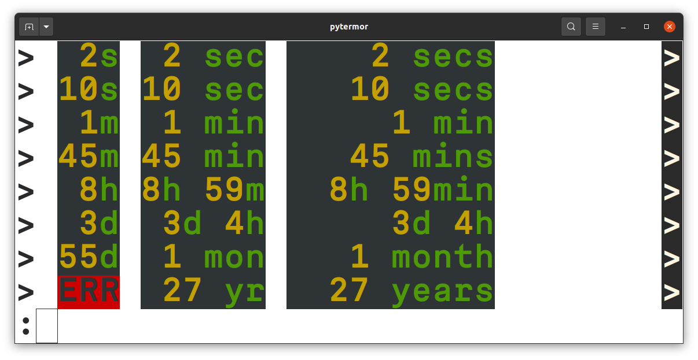

.. _guide.formatters:

.. default-role:: any

Formatters and Filters
=======================================

---------------------------
Auto-float formatter
---------------------------

---------------------------
Prefixed-unit formatter
---------------------------

---------------------------
Time delta formatter
---------------------------

.. literalinclude:: /_include/examples/ex_140_time_delta.py
   :linenos:

----------------
*StringFilters*
----------------

---------------------------
Standard Library extensions
---------------------------
